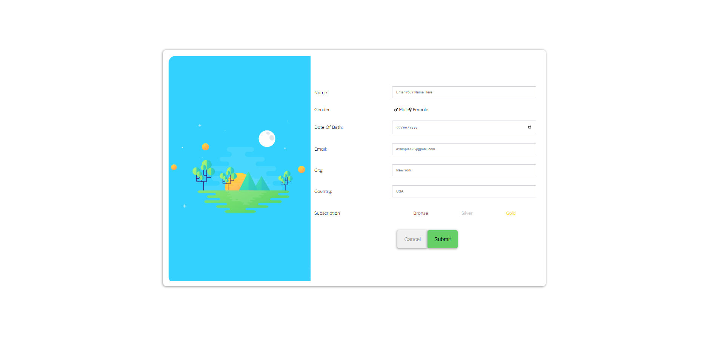

# Responsive Form Design

A simple, responsive form template built purely with **HTML** and **CSS** as a learning exercise to explore **responsive breakpoints** and layout techniques.

---

## 🌐 Live Demo
[View on GitHub Pages](https://ibrahim-rezq.github.io/responsive-form-design/)

---

## 🖼️ Preview


---

## 🎯 Purpose
This project was created as part of my learning journey in **CSS responsiveness**.  
It focuses on:
- Implementing responsive layouts without frameworks  
- Practicing media queries and flexible design  
- Building from a visual reference (GraphBerry vector)

---

## 💡 Learning Takeaways
Working on this project helped me:
- Strengthen my understanding of **responsive design principles**  
- Practice **flexbox and layout adjustments** for different screen sizes  
- Learn to convert static designs into clean, **scalable HTML/CSS** structures  
- Improve attention to **visual consistency and spacing**

---

## 🧩 Technologies Used
- **HTML5**
- **CSS3**

No frameworks, libraries, or build tools are used — just clean and responsive code.

---

## 🚀 Getting Started

1. Clone the repository:
   ```bash
   git clone https://github.com/Ibrahim-Rezq/responsive-form-design.git
    ```

2. Open the project folder and launch `index.html` in your browser.

That’s it — no setup required.

---

## 📝 Credits

Design inspired by [GraphBerry’s Free Vector Login Form](https://www.graphberry.com/).
Implementation and responsiveness by [Ibrahim Rezq](https://github.com/Ibrahim-Rezq).

---

## ⚖️ License

This project is shared **without a specific license** — feel free to learn from or adapt it for personal use.
